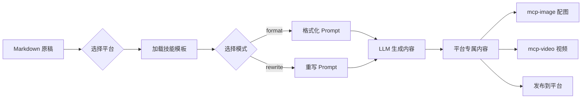

<div align="center">


# MCP Content Styles

**One Markdown, Every Platform** — Transform your content into platform-native styles via MCP

[](https://python.org)
[](https://modelcontextprotocol.io)
[](LICENSE)
[](https://github.com/jlowin/fastmcp)

[English](#english) | [中文](#中文)

</div>

---

<a name="中文"></a>

## 项目简介

**MCP Content Styles** 是一个基于 [Model Context Protocol](https://modelcontextprotocol.io) 的内容创作服务。它将你的 Markdown 原稿一键转换为知乎、公众号、小红书、微博、抖音等平台的专属风格 — 无需手动调整排版，无需切换多个工具。

<div align="center">

<br/>
<em>一份内容 → 多平台分发</em>
</div>

### 为什么需要它？

| 痛点 | 解决方案 |
|------|----------|
| 同一内容发不同平台，反复调排版 | 自动适配各平台格式规范 |
| 平台风格差异大，写作成本高 | 内置专业 Prompt 模板，LLM 直接生成 |
| 工具链分散，流程难以自动化 | 标准 MCP 协议，与 Claude/Cursor 无缝集成 |

### 核心特性

- **6 大平台** — 知乎 / 公众号 / 小红书 / 微博 / 抖音 / X(Twitter)，开箱即用
- **双模式输出** — `format` 保持结构调格式，`rewrite` 智能重写成爆款
- **MCP 原生** — 标准化接口，与 Claude Desktop、Cursor 等 AI 工具即插即用
- **模板驱动** — 基于 Markdown 模板，易于编辑、版本控制、扩展新平台

---

## 支持平台

| 平台 | 技能 | 内容类型 | 风格特点 | format | rewrite |
|:----:|------|----------|----------|:------:|:-------:|
| 📚 **知乎** | `zhihu_article` | 文章/回答 | 深度分析、逻辑严密、数据支撑 | ✅ | ✅ |
| 📰 **公众号** | `wechat_article` | 公众号文章 | AI 工程化、实战导向、结构清晰 | ✅ | ✅ |
| 📕 **小红书** | `xiaohongshu_note` | 图文笔记 | 真实技术分享、自然表达、去模板化 | ✅ | ✅ |
| 📢 **微博** | `weibo_post` | 短博文 | 快速分享、观点鲜明、话题标签 | ✅ | ✅ |
| 🎵 **抖音** | `douyin_script` | 视频脚本 | 镜头标注、节奏感强、口语化 | ✅ | ✅ |
| 🐦 **X/Twitter** | `x_post` | 推文/Thread | 简洁有力、观点鲜明、技术社区调性 | ✅ | ✅ |

> **format 模式**：保持原文核心观点，调整格式适配平台排版要求。适合已有完整内容、仅需排版调整的场景。
>
> **rewrite 模式**：基于原文智能重写，打造平台爆款风格。适合需要重新组织内容、提升传播力的场景。

---

## 快速开始

### 1. 安装

```bash
git clone https://github.com/kevinten-ai/mcp-content-styles.git
cd mcp-content-styles
pip install -e .
```

### 2. 配置 Claude Desktop

编辑 Claude Desktop 配置文件：

| 系统 | 路径 |
|------|------|
| macOS | `~/Library/Application Support/Claude/claude_desktop_config.json` |
| Windows | `%APPDATA%/Claude/claude_desktop_config.json` |
| Linux | `~/.config/claude/claude_desktop_config.json` |

添加以下配置：

```json
{
  "mcpServers": {
    "content-styles": {
      "command": "python",
      "args": ["-m", "mcp_content_styles.main"],
      "cwd": "/path/to/mcp-content-styles"
    }
  }
}
```

重启 Claude Desktop 即可使用。

### 3. 开始使用

在 Claude Desktop 中直接对话：

```
帮我把下面这篇文章转成小红书风格：

## Claude Code 使用体验
最近体验了 Claude Code，这个 AI 编程助手真的很强大！
主要特点：智能代码补全、自然语言交互、项目级理解
强烈推荐大家试试！
```

Claude 会自动调用 MCP 工具，返回小红书风格的内容。

---

## 架构设计

<div align="center">

</div>

### 系统架构

```
┌─────────────────────────────────────────────────────────────┐
│                     MCP Clients                             │
│           Claude Desktop  /  Cursor  /  Other               │
└─────────────────────┬───────────────────────────────────────┘
                      │ MCP Protocol (stdio)
                      ▼
┌─────────────────────────────────────────────────────────────┐
│                MCP Content Styles Server                     │
│                                                             │
│  ┌───────────────┐  ┌───────────────┐  ┌─────────────────┐ │
│  │  MCP Tools    │  │ Skill Manager │  │ Template Engine  │ │
│  │               │  │               │  │                  │ │
│  │ • get_platform│  │ • load skills │  │ • parse markdown │ │
│  │   _prompt     │  │ • match name  │  │ • substitute vars│ │
│  │ • list_       │  │ • format args │  │ • render output  │ │
│  │   platforms   │  │               │  │                  │ │
│  │ • convert_    │  └───────┬───────┘  └─────────────────┘ │
│  │   content     │          │                               │
│  │ • get_skill_  │          ▼                               │
│  │   content     │  ┌───────────────┐                       │
│  └───────────────┘  │ Skills (*.md) │                       │
│                     │ zhihu_article │                       │
│                     │ wechat_article│                       │
│                     │ xiaohongshu.. │                       │
│                     │ weibo_post    │                       │
│                     │ douyin_script │                       │
│                     │ x_post        │                       │
│                     └───────────────┘                       │
└─────────────────────────────────────────────────────────────┘
                      │
                      ▼ 可与其他 MCP 服务串联
          ┌───────────┼───────────┐
          ▼           ▼           ▼
    ┌──────────┐┌──────────┐┌──────────┐
    │mcp-image ││mcp-video ││平台发布   │
    │配图生成   ││视频生成   ││MCP       │
    └──────────┘└──────────┘└──────────┘
```

### 数据流



---

## API 参考

### `get_platform_prompt`

获取指定平台的完整 Prompt 模板。

```python
get_platform_prompt(
    platform="xiaohongshu",     # 平台: zhihu / wechat / xiaohongshu / weibo / douyin / x
    content_type="note",        # 类型: article / note / post / script
    mode="rewrite",             # 模式: format / rewrite
    topic="AI 工具推荐",         # 主题
    original_content="..."      # 原始 Markdown 内容
)
```

### `list_platforms`

列出所有可用平台及其支持的内容类型。

### `convert_content`

一步到位：输入 Markdown + 平台 + 模式，返回完整的转换指引和 Prompt。

```python
convert_content(
    markdown_content="...",     # Markdown 内容
    platform="zhihu",           # 目标平台
    mode="rewrite"              # 处理模式
)
```

### `get_skill_content`

获取原始技能模板（Markdown 格式），用于调试或自定义。

```python
get_skill_content(skill_name="zhihu_article")
```

---

## 内容效果示例

同一篇关于 MCP 的 Markdown 原稿，经过不同平台模板转换后的效果对比：

| 平台 | 模式 | 字数 | 效果概览 | 示例 |
|------|------|------|----------|------|
| 📚 知乎 | rewrite | ~2000 字 | 深度技术分析，引用数据，"现象-原因-对策"结构 | [查看](examples/output_samples/zhihu_article.md) |
| 📕 小红书 | rewrite | ~500 字 | 真实技术分享，自然表达，去模板化 | [查看](examples/output_samples/xiaohongshu_note.md) |
| 🎵 抖音 | rewrite | ~45 秒 | 精确镜头标注，BGM 建议，"开头 3 秒抓眼球" | [查看](examples/output_samples/douyin_script.md) |
| 🐦 X/Twitter | rewrite | 7 条 Thread | 简洁有力，技术社区调性，building in public | [查看](examples/output_samples/x_post.md) |
| 📰 公众号 | format | ~1500 字 | 步骤清晰的实战教程，含代码示例 | [查看](examples/output_samples/wechat_article.md) |
| 🐦 微博 | format | ~200 字 | 话题标签 + 观点鲜明 + 互动引导 | [查看](examples/output_samples/weibo_post.md) |

> 完整样例和对比分析见 [examples/output_samples/](examples/output_samples/)

---

## 开发指南

### 项目结构

```
mcp-content-styles/
├── src/mcp_content_styles/
│   ├── __init__.py              # 包初始化
│   ├── main.py                  # MCP 服务器入口 (FastMCP)
│   ├── skill_manager.py         # 技能管理器：加载、解析、格式化模板
│   └── skills/                  # 平台技能模板 (Markdown)
│       ├── zhihu_article.md
│       ├── wechat_article.md
│       ├── xiaohongshu_note.md
│       ├── weibo_post.md
│       ├── douyin_script.md
│       └── x_post.md
├── tests/                       # 测试
├── examples/                    # 使用示例 & 输出样例
├── assets/                      # 图片资源
└── docs/                        # 文档
```

### 本地开发

```bash
# 安装开发依赖
pip install -e ".[dev]"

# 运行测试
pytest tests/ -v

# 运行示例
PYTHONPATH=src python examples/usage_example.py
```

### 添加新平台

1. 在 `src/mcp_content_styles/skills/` 下创建 `{platform}_{type}.md`：

```markdown
# {platform}_{type}
> 平台描述

## 创作主题
{topic}

## 原始内容
{original_content}

## 格式要求
### 格式化模式 (mode="format")
- 格式要求...

### 重写模式 (mode="rewrite")
- 重写要求...
```

2. 重启 MCP 服务器 — 新技能自动发现并加载，无需修改代码。

---

## 完整工作流

```
                        ┌─── mcp-image (配图) ───┐
                        │                        │
Markdown ──► MCP Server ──► LLM 生成 ──► 平台内容 ──┤
                        │                        │
                        └─── mcp-video (视频) ───┘
                                                 │
                                                 ▼
                                          平台 MCP (发布)
```

MCP Content Styles 专注于 **Prompt 生成** 这一环节，通过与其他 MCP 服务（配图、视频、发布）组合，构建完整的内容创作自动化流水线。

---

## 贡献

欢迎提交 Issue 和 PR！

**提交规范：** `fix:` 修复 / `feat:` 新功能 / `docs:` 文档 / `refactor:` 重构

**Roadmap：**

- [ ] 更多平台（B 站、快手、LinkedIn）
- [ ] 自定义模板上传
- [ ] Web UI 管理界面
- [ ] 模板效果预览
- [ ] 多语言支持 (i18n)

---

<a name="english"></a>

## English

**MCP Content Styles** is an [MCP](https://modelcontextprotocol.io)-based service that transforms Markdown content into platform-specific styles for Chinese social media platforms (Zhihu, WeChat, Xiaohongshu, Weibo, Douyin).

### Quick Start

```bash
git clone https://github.com/kevinten-ai/mcp-content-styles.git
cd mcp-content-styles && pip install -e .
```

Add to Claude Desktop config:

```json
{
  "mcpServers": {
    "content-styles": {
      "command": "python",
      "args": ["-m", "mcp_content_styles.main"],
      "cwd": "/path/to/mcp-content-styles"
    }
  }
}
```

### Features

- **6 platforms**: Zhihu, WeChat Official Account, Xiaohongshu, Weibo, Douyin, X/Twitter
- **2 modes**: `format` (preserve structure, adjust style) / `rewrite` (AI-powered rewrite)
- **MCP native**: Standard protocol, works with Claude Desktop, Cursor, and any MCP client
- **Template-driven**: Markdown-based templates, easy to extend

### MCP Tools

| Tool | Description |
|------|-------------|
| `get_platform_prompt` | Get a complete prompt template for a specific platform |
| `list_platforms` | List all available platforms and content types |
| `convert_content` | Convert markdown to platform-specific format with instructions |
| `get_skill_content` | Get raw skill template content |

---

<div align="center">

**[⬆ Back to Top](#mcp-content-styles)**

MIT License © 2024 [kevinten-ai](https://github.com/kevinten-ai)

</div>
