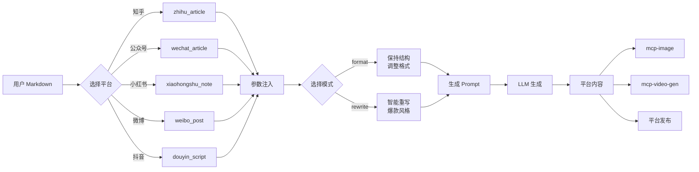

<div align="center">

# 📝 MCP Content Styles

**一站式内容创作 MCP 服务** | 将你的 Markdown 转化为各平台专属风格

[](https://python.org)
[](https://modelcontextprotocol.io)
[](LICENSE)

[English](#english) | [中文](#中文)

</div>

---

## 📋 目录

- [🎯 项目简介](#-项目简介)
- [🏗️ 架构设计](#️-架构设计)
- [✨ 支持平台](#-支持平台)
- [🚀 快速开始](#-快速开始)
- [📖 使用指南](#-使用指南)
- [🔧 开发说明](#-开发说明)
- [🤝 贡献指南](#-贡献指南)

---

## 🎯 项目简介

**MCP Content Styles** 是一个基于 [Model Context Protocol (MCP)](https://modelcontextprotocol.io) 的服务，帮助内容创作者将 Markdown 内容一键转换为各平台专属风格。

### 工作流程

```
┌─────────────────┐     ┌──────────────────┐     ┌─────────────────┐
│   你的Markdown   │────▶│  MCP Content    │────▶│  平台专属内容   │
│   原始内容      │     │  Styles 服务    │     │  (知乎/小红书等) │
└─────────────────┘     └──────────────────┘     └─────────────────┘
                               │
                               ▼
                        ┌──────────────────┐
                        │   其他 MCP 服务   │
                        │  - mcp-image     │
                        │  - mcp-video-gen │
                        │  - 平台发布MCP   │
                        └──────────────────┘
```

### 核心特性

| 特性 | 说明 |
|------|------|
| 🎨 **多平台支持** | 知乎、公众号、小红书、微博、抖音一键转换 |
| 🔄 **双模式输出** | `format` 保持结构调整风格，`rewrite` 智能重写 |
| 📝 **Markdown 原生** | 基于 Markdown 模板，易于编辑和版本控制 |
| 🔌 **MCP 协议** | 标准化接口，与 Claude、Cursor 等 AI 工具无缝集成 |
| 🛠️ **可扩展** | 简单添加新的平台模板 |

---

## 🏗️ 架构设计

### 系统架构图

```
┌─────────────────────────────────────────────────────────────────┐
│                        MCP Client                               │
│              (Claude Desktop / Cursor / Other)                  │
└───────────────────────────┬─────────────────────────────────────┘
                            │ MCP Protocol
                            ▼
┌─────────────────────────────────────────────────────────────────┐
│                    MCP Content Styles Server                    │
│  ┌─────────────────┐  ┌─────────────────┐  ┌─────────────────┐ │
│  │   Skill Manager │  │   MCP Tools     │  │  Template Engine│ │
│  │  ┌───────────┐  │  │  ┌───────────┐  │  │  ┌───────────┐  │ │
│  │  │ zhihu     │  │  │  │ get_platform│  │  │  │ 参数替换   │  │ │
│  │  │ wechat    │  │  │  │ _prompt   │  │  │  │ 格式渲染   │  │ │
│  │  │ xiaohongshu│  │  │  │ list_     │  │  │  │ 内容生成   │  │ │
│  │  │ weibo     │  │  │  │ platforms │  │  │  └───────────┘  │ │
│  │  │ douyin    │  │  │  │ convert_  │  │  │                 │ │
│  │  └───────────┘  │  │  │ content   │  │  │                 │ │
│  │                 │  │  └───────────┘  │  │                 │ │
│  └─────────────────┘  └─────────────────┘  └─────────────────┘ │
└─────────────────────────────────────────────────────────────────┘
```

### 数据流图



---

## ✨ 支持平台

| 平台 | 技能名称 | 内容类型 | 风格特点 | 模式支持 |
|------|----------|----------|----------|----------|
| 📚 **知乎** | `zhihu_article` | 文章/回答 | 技术深度、逻辑严密 | format ✅ rewrite ✅ |
| 📰 **公众号** | `wechat_article` | 文章 | AI工程化、实战导向 | format ✅ rewrite ✅ |
| 📕 **小红书** | `xiaohongshu_note` | 图文笔记 | 工具推荐、Emoji 丰富 | format ✅ rewrite ✅ |
| 🐦 **微博** | `weibo_post` | 短博文 | 快速分享、观点鲜明 | format ✅ rewrite ✅ |
| 🎵 **抖音** | `douyin_script` | 视频脚本 | 镜头标注、节奏感强 | format ✅ rewrite ✅ |

### 模式说明

| 模式 | 说明 | 适用场景 |
|------|------|----------|
| **`format`** | 保持原文核心观点，调整格式适配平台 | 已有完整内容，仅需排版调整 |
| **`rewrite`** | 基于原文智能重写，打造爆款风格 | 需要重新组织内容，提升传播力 |

---

## 🚀 快速开始

### 1. 安装

```bash
# 克隆仓库
git clone https://github.com/kevinten-ai/mcp-content-styles.git
cd mcp-content-styles

# 安装依赖
pip install -e .
```

### 2. Claude Desktop 配置

编辑配置文件：
- **macOS**: `~/Library/Application Support/Claude/claude_desktop_config.json`
- **Windows**: `%APPDATA%/Claude/claude_desktop_config.json`
- **Linux**: `~/.config/claude/claude_desktop_config.json`

```json
{
  "mcpServers": {
    "content-styles": {
      "command": "python",
      "args": ["-m", "mcp_content_styles.main"],
      "cwd": "/Users/kevinten/projects/mcp-content-styles"
    }
  }
}
```

重启 Claude Desktop。

### 3. 使用示例

#### 示例 1：获取平台 Prompt

```python
# 在 Claude 中使用 MCP 工具
prompt = get_platform_prompt(
    platform="xiaohongshu",
    content_type="note",
    mode="format",
    topic="AI 工具推荐",
    original_content="""
## Claude Code 使用体验

最近体验了 Claude Code，这个 AI 编程助手真的很强大！

主要特点：
- 智能代码补全
- 自然语言交互
- 项目级理解

强烈推荐大家试试！
"""
)
```

#### 示例 2：完整工作流

```python
# 1. 获取平台专属 Prompt
prompt = convert_content(
    markdown_content=my_article,
    platform="zhihu",
    mode="rewrite"
)

# 2. Claude 使用 Prompt 生成内容
content = claude.generate(prompt)

# 3. 生成配图
image = mcp_image.generate(f"知乎风格配图: {content[:100]}")

# 4. 发布到平台
mcp_zhihu.publish(content, image)
```

---

## 📖 使用指南

### MCP Tools 详细说明

#### 1. `get_platform_prompt`

获取指定平台的 prompt 模板。

**参数：**

| 参数 | 类型 | 必填 | 说明 |
|------|------|------|------|
| `platform` | string | ✅ | 平台名称：`zhihu`, `wechat`, `xiaohongshu`, `weibo`, `douyin` |
| `content_type` | string | ✅ | 内容类型：`article`, `note`, `post`, `script` |
| `mode` | string | ✅ | 处理模式：`format` 或 `rewrite` |
| `topic` | string | ✅ | 文章主题 |
| `original_content` | string | ✅ | 原始 Markdown 内容 |

**返回值：** 格式化后的 prompt 字符串

#### 2. `list_platforms`

列出所有支持的平台。

**返回值：** 平台列表（带 Emoji 和描述）

#### 3. `convert_content`

转换 Markdown 内容并返回转换说明。

**参数：**

| 参数 | 类型 | 必填 | 说明 |
|------|------|------|------|
| `markdown_content` | string | ✅ | Markdown 内容 |
| `platform` | string | ✅ | 目标平台 |
| `mode` | string | ✅ | 处理模式 |

#### 4. `get_skill_content`

获取原始技能模板内容。

**参数：**

| 参数 | 类型 | 必填 | 说明 |
|------|------|------|------|
| `skill_name` | string | ✅ | 技能名称，如 `zhihu_article` |

### 平台风格对照

<details>
<summary>📚 知乎 (zhihu_article) - 点击展开</summary>

**风格特点：**
- 逻辑严密，深度分析
- 使用专业术语（首次解释）
- 数据、案例、图表支撑
- "现象-原因-对策" 或 "是什么-为什么-怎么做" 结构

**格式化模式：**
- 专业、理性语言
- 三级标题分隔
- 编号列表 (1. 2. 3.)
- 重要概念 **加粗**
- 引用权威观点使用 > 引用块

**重写模式：**
- 标题有深度或争议性
- 学术或行业洞察力
- 客观理性，引用权威来源

</details>

<details>
<summary>📕 小红书 (xiaohongshu_note) - 点击展开</summary>

**风格特点：**
- 亲切称呼："宝子们"、"家人们"
- 情绪表达："终于找到了"、"相见恨晚"
- Emoji 丰富 🌟 ✨ 💡 🔥
- 互动引导："你们用过吗？"

**格式化模式：**
- 添加 Emoji 装饰
- `##` 作为标题
- 短段落（每段 2-3 行）
- `###` 分隔不同部分
- 结尾 5-8 个 hashtags

**重写模式：**
- 增加个人使用体验
- 痛点 → 解决方案 → 效果 → 总结 结构

</details>

<details>
<summary>🎵 抖音 (douyin_script) - 点击展开</summary>

**风格特点：**
- 开头 3 秒抓眼球："你知道吗"、"千万别"、"绝了"
- 快节奏，信息密度高
- 展示前后对比
- 强调"简单"、"快速"、"免费"

**格式化模式：**
- `[镜头]` `[画面]` `[字幕]` 标注
- 标注 BGM 建议
- 标注转场效果
- 控制时长（15-60 秒）

**重写模式：**
- 钩子 → 问题 → 方案 → 效果 → 引导 结构
- 结尾引导关注/点赞

</details>

---

## 🔧 开发说明

### 项目结构

```
mcp-content-styles/
├── src/mcp_content_styles/
│   ├── __init__.py              # 包初始化
│   ├── skill_manager.py         # 技能管理器核心
│   ├── main.py                  # MCP 服务器入口
│   └── skills/                  # 平台技能模板
│       ├── zhihu_article.md
│       ├── wechat_article.md
│       ├── xiaohongshu_note.md
│       ├── weibo_post.md
│       └── douyin_script.md
├── tests/                       # 测试套件
├── examples/                    # 使用示例
└── docs/                        # 文档（待完善）
```

### 本地开发

```bash
# 1. 安装开发依赖
pip install -e ".[dev]"

# 2. 运行测试
pytest tests/ -v

# 3. 运行特定测试
pytest tests/test_skill_manager.py::TestSkillManager::test_load_skills -v

# 4. 运行示例
PYTHONPATH=src python examples/usage_example.py
```

### 添加新平台

1. **创建技能模板** `src/mcp_content_styles/skills/{platform}_{type}.md`:

```markdown
# {platform}_{type}
> 平台描述

## 创作主题
{topic}

## 原始内容
{original_content}

## 格式要求
### 格式化模式 (mode="format")
- 格式要求...

### 重写模式 (mode="rewrite")
- 重写要求...
```

2. **重启 MCP 服务器**，新技能自动加载

---

## 🤝 贡献指南

欢迎提交 Issue 和 PR！

### 提交规范

- 🐛 **Bug 修复**: `fix: 修复xxx问题`
- ✨ **新功能**: `feat: 添加xxx功能`
- 📝 **文档**: `docs: 更新xxx文档`
- 🔧 **重构**: `refactor: 重构xxx模块`

### 待办事项

- [ ] 添加更多平台（B站、快手、Twitter 等）
- [ ] 支持自定义模板上传
- [ ] Web UI 管理界面
- [ ] 模板效果预览功能
- [ ] 多语言支持

---

## 📄 License

MIT License © 2024 kevinten-ai

---

<div align="center">

**[⬆ 回到顶部](#-mcp-content-styles)**

Made with ❤️ by [kevinten-ai](https://github.com/kevinten-ai)

</div>
